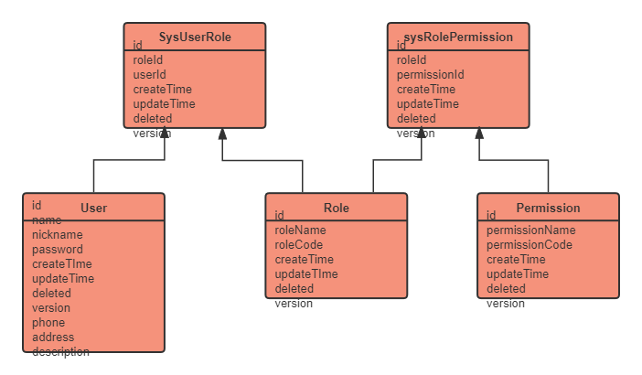

# Envelope-cli 自用脚手架说明

<br/>
<br/>


此文档用于备忘以及合作开发，所有集成的构建都是独立的，对于不需要的部分可以删除，cli脚手架尽量做到最小侵入以及极简配置，方便二次开发以及额外配置。

<br/>


## 技术清单

| #   | 目录                      | 说明               | 跳转        |
|-----|-------------------------|------------------|-----------|
| 1   | springboot-swagger2     | 文档系统             | [跳转](#1)  |
| 2   | springboot-exception    | 统一异常处理           | [跳转](#2)  |
| 3   | R                       | 统一返回类型           | [跳转](#3)  |
| 4   | springboot-mybatis-plus | 简化CRUD操作         | [跳转](#4)  |
| 5   | junit                   | 单元测试框架           | [跳转](#5)  |
| 6   | @Log                    | 使用aop切面编程，自动收集日志 | [跳转](#6)  |
| 7   | springboot-druid        | 整合druid连接池，开启sql监控 | [跳转](#7)  |
| 8   | springboot-thymeleaf    | 集成模板引擎，支持ssm开发     | [跳转](#8)  |
| 9   | springboot-email        |使用hutool email工具发送邮件，支持附件和模板| [跳转](#9)  |
| 10  | springboot-async        |异步多线程| [跳转](#10) |
| 11  | springboot-validator    | 参数校验 | [跳转](#11) |
| 12  | captcha | hutool 工具实现登录验证码 | [跳转](#12) |
| 13  | springboot-security | 安全框架，支持jwt无状态和ssm使用| [跳转](#13) |
| 14 | scheduler | 异步定时任务 | [跳转](#14) |


## 开发相关

<p id="1" />

### Swagger2 文档

输入 http://localhost:9080/envelope/swagger-ui.html 进入Swagger2文档页面
 
项目集成swagger2文档，并且使用swagger提供的注解编写接口规范，具体参考 ```controller/UserController``` 中预先写好的格式编写

高版本springboot集成swagger2可能会报错（本项目确实报错了），在 ```common/config/WebMvxConfigurer``` 中重新定义了Swagger2的路径，如后续开发中产生了冲突（基本不可能有冲突）请修改

```common/config/Swagger2Config``` 中定义了Swagger2的配置，有需要请修改


<p id="2" />

### GlobalException 统一异常抛出

项目定义了统一异常 ```GlobalException``` 在统一异常中存在状态码的定义，具体存放在 ```common\utils\RestCode```` 中，
RestCode中定义的状态码是 **统一返回类型 R 和 统一异常 GlobalException** 共用的！！！

默认情况下统一异常会抛出自定义异常码5554，其余异常则抛出5555！

自定义统一异常的意义是：**对重要通路进行额外捕获，方便排查！**

例子如下：

```java
@RestController
@RequestMapping("/")
class GlobalExceptionControllerTest {

    @GetMapping("/test1")
    public R test1() {
        // 自定义异常，抛出异常码5554
        throw new GlobalException("custom exception", RestCode.ERROR_CUSTOM_CODE); 
    }

    @GetMapping("/test2")
    public R test2() throws GlobalException{
        int i = 1 / 0; // 常规异常，抛出 by zero
        return R.ok();
    }
}
```

<p id="3"/>

### 统一返回类型 R

项目不使用传统的 ```Map<String, Object>``` 的格式返回数据，而是封装了一个统一返回类型类 ```R```，其代码存放在 ```common\utils``` 中

所有的controller中接口的返回类型都是R，R支持链式调用，可以动态设置返回码和返回参数，例子如下：

```java
@RestController
@RequestMapping("/")
class TestController {

    @GetMapping
    @RestController("/test")
    public R test() {
        return R.ok().data("res", new Object());
    }
}
```

<p id="4"/>

### mybatis-plus
本项目不使用mybatis，而使用增强版本的 mybatis-plus，对于元数据的编辑（自动插入和自动更新）统一存放在 ```common\handler``` 中

mybatis-plus编写有规定格式，编写请参考已有的代码格式。其中部分包定义为：

- service 为服务层，在service中的impl包为具体逻辑业务实现
- mapper 持久层，连接mysql数据库用，mapper中只编写多表查询逻辑（使用注解编写）
- pojo 实体类


**以下是注意事项：**

在pojo中编写新的实体类格式请参考User、 SysLog的swagger以及mybatis-plus注解编写，每一个实体类的参数都要有详细的注解！

实体类的id统一为uuid！

单表查询逻辑统一写在serviceImpl中，controller最好只调用serviceImpl的接口！

单表CRUD统一使用mybatis-plus中提供的QueryWrapper、UpdateWrapper等 或者 预留的接口如 ```selectById``` 等实现！

mapper中只编写多表查询逻辑或者一些用wrapper实现比较困难的查询逻辑，使用注解的方式查询mysql，具体如下：
```java
interface TestMapper{
    
    @Select("select * from `user` where `id` = #{id}")
    List<User> selectById(String id);
}
```

service中建议定义interface接口再在impl包中定义实现类 是 **仅争对使用mybatis-plus的代码**，如邮件或者其余单独的逻辑业务类可以直接将类写在```service```包中

<p id="5" />

### junit 单元测试组件

集成junit进行单元测试，建议对编写的组件进行一定程度的测试在进行集成！在 ```src\test``` 包中编写单元测试代码

每一个组件（或功能）单独编写一个java文件，具体编写格式参考已有的测试文件

<p id="6"/>

### @Log 日志切面注解

使用 ```@Log``` 注解自动收集日志！

集成aop进行切换切面编程，实体类 ```SysLog``` 存放在 ```pojo``` 包中，自定义日志接口和切面定义类存放在 ```enhance\aop``` 中

自定义日志接口会自动受击被注解的方法信息，详细参数查看 ```SysLog``` 中的swagger注解

使用方法为：

```java
@RequestMapping("/")
@RestController
class Controller {

    // @Log(value = "访问test接口")
    @Log("访问test接口")
    public R test(String msg){
        System.out.println();
    }
}
```

目前日志只是打印，具体保存逻辑尚未编写，可以在 ```enhance\LogAspect``` 中的环切方法中定义保存或者处理逻辑


<p id="7"/>

### druid 数据库监控

整合druid连接池，开启sql监控，慢SQL检测

浏览器输入 http://localhost:9080/envelope/druid/sql.html 进入druid监控页面！

在 ```application.yaml``` 中修改配置即可，只用于数据库监控和排错，基本不用进行额外操作，不侵入代码，
具体参数列表可以参考： https://developer.aliyun.com/article/1157595

<p id="8"/>

### thymeleaf 模板引擎
项目集成模板引擎，用于开发cli时测试部分页面显示效果，也用引擎重写部分监听页面。

项目主攻方向是作为前后端分离项目的后端使用，虽然支持thymeleaf，但还是推荐使用前后端分离，
除部分项目，如邮件、文件服务器、监控页面等和后端高结合的部分，实际业务请使用单独的前端框架完成。

thymeleaf模板页面存放于 ```resources/template``` 中，
前端页面使用 ```tailwindcss,jquery,semantic-ui``` 等js库辅助开发

前端页面中如有修改请标注，ssm高度耦合，thymeleaf中（特别是接口部分）的变动请务必通知小组成员！

<p id="9" />

### email 邮件模板

使用hutool工具包（类似于js的lodash）配合java原生的email包编写，支持thymeleaf定制邮件模板

在 ```resources/templates/emailTemplate.html``` 中存放邮件模板，使用tailwindcss编辑样式，显示英文，字体为苹果的字体。

在模板中必须填写两个参数 ```name```和```code```,其中:```name```为收件者姓名，```code```为授权码（验证码），
邮件模板基本只用于接受验证码，但是不管是不是发送模板邮件都可以携带文件，案例参考test文件中的send2和send4函数。

thymeleaf文件可以直接预览，使用默认浏览器打开即可。

在 ```resources/template/static/loleLoge.png``` 存放的是模板最上面显示的lole，默认为envelope的图标，可以替换成需要的图片，显示比例为60x60。

<p id="10" />

### @Async 线程池异步注解

脚手架自定义了线程池，默认开4个线程，最大开8个线程，执行策略为 ```CallerRunsPolicy``` ,
一定程度上可以保证任务会被某一个线程执行。

线程池执行逻辑代码在```common\config\ExecutorConfig``` 中，异步任务统一写在 ```enhance\async``` 中，并且以 ```Async``` 开头命名文件，
具体编写格式查看demo文件 ```enhance\async\AsyncExample``` 和 test文件 ```AsyncTest```.

开线程池执行异步函数可能会不可预测的后果，尽量在如下情况发生时再尝试使用线程池：

- 有大量短时间任务需要处理
- 需要管理多个任务的执行顺序
- 需要限制并发执行的任务数量
- 需要异步的时候
- 或者同步代码效果太差，迫不得已尝试使用线程池
- 
其余情况请**尽量**不要使用线程池和异步注解！

<p id="14" />

### scheduler 异步定时任务

对定时器的封装，只需要实现并重写```ScheduleService```方法即可，主要使用场景为:
- 需要统一执行定时任务
- 需要统一线程池管理，进行系统优化
- 进行代码优化时


---


<p id="11"/>

### validation 参数校验
脚手架集成spring-boot-starter-validation做参数校验，这个模块没太大变化，主要是重写了一些异常处理类，
需要可以在全局异常类中三次定义。

使用规则不变，详细接口查看：https://blog.csdn.net/weixin_43296313/article/details/121430724

## 安全相关

### spring-security 

项目集成security安全框架，不再集成形容shiro或者oauth等第三方安全框架，如有需要自己处理。

安全框架继承了两套方案，分别是：
- 使用预先编写的thymeleaf模板页面做SSM
- 使用jwt做前后端分离的无状态认证

### 角色模型
envelope-cli预先定义了角色模型，并提供了登录、鉴权的解决方案，下图是E-R关系图：



<p id="12"/>

### 图形验证码

使用hutool自带的工具改造而来，直接```Get```请求接口```/getCode``` 即可.

源码在 ```controller\th\ThSecurityLoginController``` 中


<p id="13"/>

### SSM方案

直接使用thymeleaf页面，即意味着**完全在envelope-cli**上进行ssm项目开发。所有thymeleaf请按照规范在```resources\thymeleaf```包下编写，
其中 ```securityTemplate.html``` 为登录页面，提供了登录失败的三种异常提示。

当用户成功登录之后将会跳转到 ```toIndex```接口，注意：```toIndex```是GetMapping接口，请在```controller\th\ThSecurityLoginController```中定义
关于```\toIndex```接口和其对应的thymeleaf文件，例如：

```java
@Controller
class ThSecurityController {

    @GetMapping("/toIndex")
    public String toIndex(){
        return "index"; // 对应index.html页面
    }
}
```

关于Security的配置文件写在```security\WebSecurityConfig```中，同级目录中还存在```LoginSucess```,```LoginFailure```和```LogoutSuccess```
三个文件，分别对应：登录成功跳转逻辑、登录失败处理逻辑 和 登出处理逻辑。

用户认证逻辑写在 ```service\impl\UserDetailsServiceImpl``` 中，对查询逻辑进行了定义优化，查看的时候建议先看脚手架规定的规范角色模型。

### jwt 无状态认证
对应前后端分离的解决方案，选择jwt方案的时候建议把ssm部分的代码删了（不删也不影响，不要动接口就行）


---

## 缓存策略

### redis

项目不涉及具体的redis操作，只需要会用redisTemplate就行，关于redisTemplate的详细使用方法可以参考下述博客：

- https://blog.csdn.net/lydms/article/details/105224210 （一）
- https://blog.csdn.net/lydms/article/details/105512006 （二）
- https://blog.csdn.net/lydms/article/details/106068364 （三）

**注意：在项目中操作redis缓存尽量不要用BoundValueOperations或者ValueOperations来操作，建议全部使用redisTemplate.boundValueOps()...**，
增加可读性，减少记忆量。


